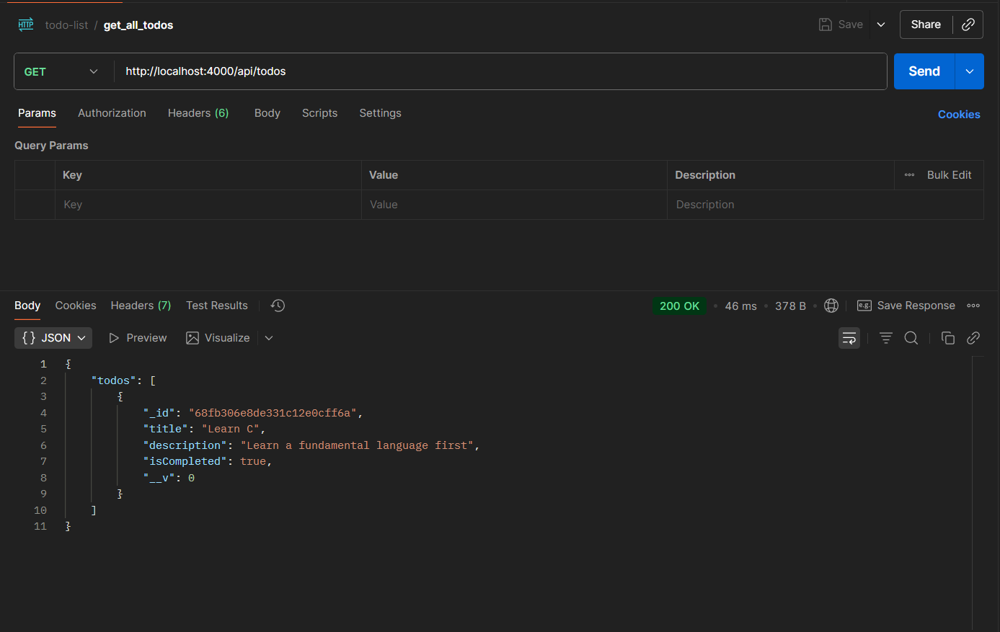
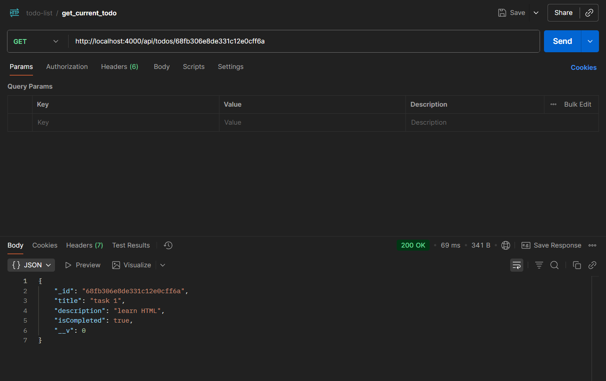
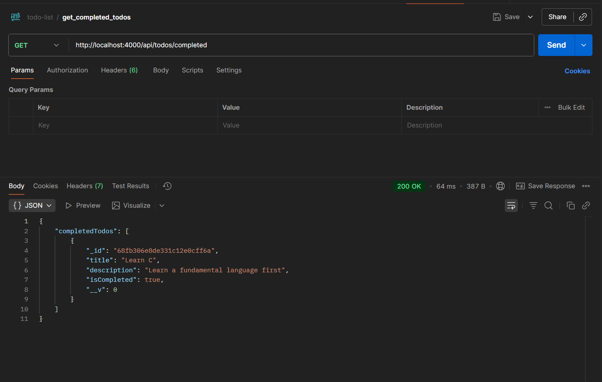
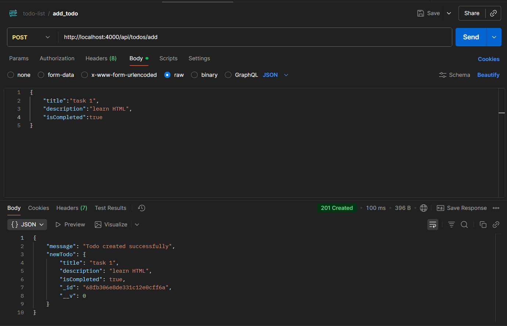
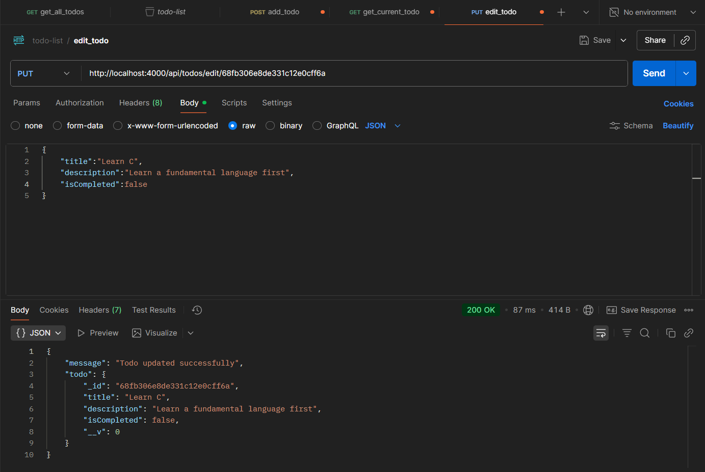
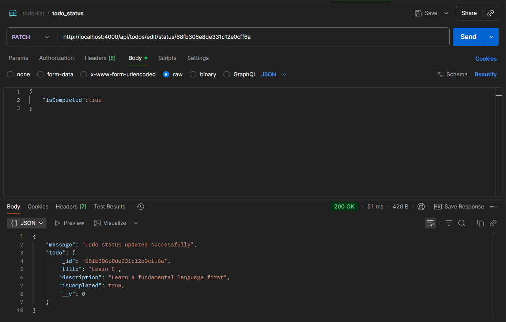
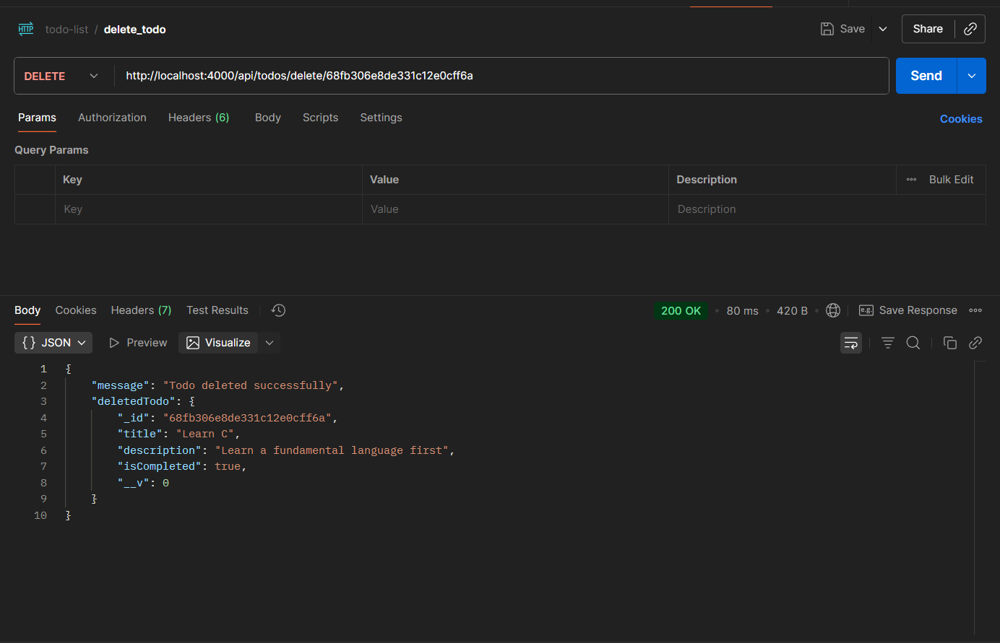

# Todo List Application

This is a simple Todo List application built with Node.js, Express, and MongoDB. It allows users to create, read, update, and delete todos. Users can also mark todos as completed.

## Features

- Add new todos
- View all todos
- View completed todos
- Update todo details
- Update todo status (completed or not)
- Delete todos

## Technologies Used

- Node.js
- Express.js
- MongoDB with Mongoose
- JavaScript

## Installation

1. Clone the repository
2. Run `npm install` to install dependencies
3. Create a `.env` file in the root directory and add:

```bash
MONGO_URI=your_mongodb_connection_string
PORT=your_port_number
```

4. Run the server using `npm start` or `node server.js`
5. API will be available at `http://localhost:PORT/api/todos`

## API Routes

### Get All Todos

- Endpoint: `/api/todos/`
- Method: GET



### Get Current Todo

- Endpoint: `/api/todos/:id`
- Method: GET



### Get Completed Todos

- Endpoint: `/api/todos/completed`
- Method: GET



### Add Todo

- Endpoint: `/api/todos/add`
- Method: POST
- Body:
  - title
  - description
  - isCompleted (optional)



### Edit Todo

- Endpoint: `/api/todos/edit/:id`
- Method: PUT
- Body (any of these fields):
  - title
  - description
  - isCompleted



### Update Todo Status

- Endpoint: `/api/todos/edit/status/:id`
- Method: PATCH
- Body:
  - isCompleted (boolean)



### Delete Todo

- Endpoint: `/api/todos/delete/:id`
- Method: DELETE



## Notes

- All endpoints return JSON responses
- Todo fields are validated before saving
- Completed todos are marked using a boolean flag

## Author

Aayush Joshi
